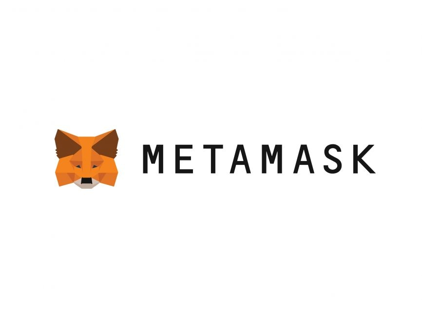

## Simple DApp with MetaMask integration

In this tutorial we will guide you step by step how to integrate your MetaMask
wallet and build simple DApp on Ethereum Kovan testnet. For this to
achieve we will use Python based smart contract developing and testing framework
Brownie. And for integration with our front-end and smart contract we will Ethers.js
library.

Having in mind that this is bare-bone implementation we will relay on
MetaMask API and in later tutorials we will move to more advanced tools such as
web3-react, react-moralis, web3Modal and useDapp. All of those tools
basically have role to be layer between front-end and blockchain and deployed smart contract.

 

### Step 1: Install dependencies and initiate new empty Brownie project

We assume that you already have Python >= 3.6.0, NVM, NPM, Node and MetaMask extension
installed on your local machine. If you don't have please go first
install this and then continue with rest of tutorial:

    $ md SimpleMetaMaskIntegration && cd SimpleMetaMaskIntegration

We will use pipenv to creation virtual environment in which we will install
eth-brownie

    $ pip install pipenv
    $ pipenv --version
    $ ...version 2022.1.8

Creating virtual environment

    $ pipenv shell
    $ ...Successfully created virtual environment!

Install pipx, eth-brownie and ganache-cli (this way is recommended by Brownie)

    (your_venv)$ python3 -m pip install pipx
    (your_venv)$ python3 -m pipx ensurepath
    (your_venv)$ ...Otherwise pipx is ready to go! ✨ 🌟 ✨

Install Brownie

    (your_venv)$ pipx install eth-brownie
    (your_venv)$ ...done! ✨ 🌟 ✨

Installing Ganache  (Ganache is used to create blockchain in local enviroment on which we can test our contracts. Brownie under the hood use Ganache for same purpose)

    (your_venv)$ npm install -g ganache-cli
    (your_venv)$ ganache-cli --version
    (your_venv)$ Ganache CLI v6.12.2 (ganache-core: 2.13.2)

### Starting new Brownie project

    (your_venv)$ brownie init SimpleMetaMaskIntegration

or if folder is empty simply

    (your_venv)$ brownie init

### Brownie folder structure inside SimpleMetaMaskIntegration

 

    - build: result of compiling process (contracts ABI`s, json file with history of deployed contracts etc.)

    - contracts: smart contracts

    - scripts: deploy scripts and other supporting functions

    - tests: fixtures and test file

## Step 2: Creating and compiling simple smart contract in Solidity

 

Go to Brownie folder `/contract` and create file `SimpleContract.sol`

Inside that file past following code

    // SPDX-License-Identifier: MIT

    pragma solidity 0.8.0;

    contract SimpleContract {
        // Here we declar state varibale string type
        string[] public name;

        // This function take string input and append (write to blockchaine) to
        // our state variable (list)

        function addName(string memory _name) public {
            name.push(_name);
        }

        // This function pull name from indexed position we would like to see and
         // show us on the front-end (read from blockchain)

        function returnName(uint256 _index) public view returns (string memory) {
            return name[_index];
        }
    }

 

Then go back to shell and type

    $brownie compile

You should get something like

    # And you should get something like
    $Compiling contracts...
    Solc version: 0.8.0
    Optimizer: Enabled  Runs: 200
    EVM Version: Istanbul
    Generating build data...
    - SimpleContract

    Project has been compiled. Build artifacts saved at /home/ilijapet/my_tutorials/Connect_MetaMask_to_frontend_options/SimpleMetaMaskIntegration/build/contracts

Cool now we have our smart contract compiled. There is two additional steps before we move on integration with front end:

1. Write deploy script
2. Deploy smart contract to Kovan testnet

But before we deploy our contract to Kovan test net we will need few fake ETH to cover cost of our transaction on test net. And this test ETH you can get by passing your ETH addresses from MetaMask to following two sites (here is where you can get address in MetaMask)

 

 

    https://faucet.paradigm.xyz/

or from Chainlink

    https://docs.chain.link/docs/link-token-contracts/#ethereum

After few seconds you should see in your wallet test ETH (please make sure that you change you network from mainnet to kovan)

 

 

Inside your Brownie project root directory maker .env file

    $vim .env

And inside .env file please add following elements

    # Here we have private key export
    PRIVATE_KEY=your_private_key_from_metamask

    # Then we should ad infura entry point though which we will approach to ethereum
    export WEB3_INFURA_PROJECT_ID=your_kovan_testnet_infura_endpoint

 

BUT BEAFORE WE CONTINUE FURTHER PLEASE:

1. DON'T USE PRIVATE KEYS FROM ACCOUNT THAT YOU USE FOR ANY KIND OF REAL TRANSACTION. OPEN NEW PROFILE IN YOUR LET'S SAY BRAVE BROWSER AND INSIDE THAT NEW PROFILE INSTALL AGAIN METAMASK EXTENSION (WITH NEW SEED PHRASE). AND USE ONLY THAT WORKING PROFILE WHILE EXPERIMENTING AND DEVLOPING YOUR DApps.

2. PLEASE ADD .ENV FILE TO YOUR .GITIGNORE FILE

Way to get private keys from your metamask is

Way to get your infura end point please just go to infura.io, open your account and find your Kovan keys (past to newly created .env file)

    https://infura.io/

Infura is node provider, part of ConsenSys (important Ethereum infrastructure provider)

Ones you get you private key and infura endpoint for kovan test net please past that values inside your .env file in brownie project root directory (as we describe above).

Next step is to create very important brownie-config.yaml file

    $ vim brownie-config.yaml

Inside this file past following values

    dotenv: .env
    wallets:
        from_key: ${PRIVATE_KEY}

Ones we set up all those parameters it is time to write deploy script inside brownie `./scripts` folder

    $ vim deploy_contract.py

Inside `deploy_contract.py` file write following code:

    #!usr/bin/python3s
    from brownie import config, accounts, SimpleContract

    def main():

        # Get account from .env file and assigne to dev variable
        dev = accounts.add(config["wallets"]["from_key"])

        # Use this account to deploy smart contract
        SimpleContract.deploy({"from": dev})

Now run deploy script

    $brownie run scriptr/deploy_contract.py --network kovan

If everything goes well you should get something like:

    Brownie v1.17.2 - Python development framework for Ethereum

    SimplemetamaskintegrationProject is the active project.

    Running 'scripts/deploy_contract.py::main'...
    Transaction sent: 0xb162127d9ce5208c05767d94bef559bc8905e725ddb6dcb59fdf8ea0cde5d9d8
    Gas price: 2.500000007 gwei   Gas limit: 117775   Nonce: 401
    SimpleContract.constructor confirmed   Block: 29978713   Gas used: 107069 (90.91%)
    SimpleContract deployed at: 0xBe6f793D9C83fdD912D990C41e836E76594771c3

Here Brownie informs us that deployment was successful and our smart contract is now living on Kovan testnet. We can check this by passing address to which contract is deployed `0xBe6f793D9C83fdD912D990C41e836E76594771c3` to https://etherscan.io/ (Don't forget to change network to kovan inside etherscan ones you are there. Right corner up)

 

Cool thing about Brownie is that it automatically take care about all addresses to which we deploy some version of our contract. And this is how we can always go back to some previous version. If you go to `./build/` deployments folder you will find map.json file. And inside that file you will see all kovan test net addresses to which your smart contract has been deployed.

        {
        "42": {
            "SimpleContract": [
            "0xBe6f793D9C83fdD912D990C41e836E76594771c3",
            "0x4cff1166885e653f8640dbE43e955AEd79F9a745",
            "0x390DE56F529a1C9dd8CadD9F81beB1b7A7821EA8"
            ]
        }
        }

In same folder `./build/contracts` you have ABI as artefact of compilation process. This ABI, together with deployment address and node provider are main elements when we now start to build integration with our front end.

# Front-end and integration

Half job done! Congratulation! Now lets us move to front end and how we
actually integrate our page with functionality we coded inside our smart contract.

In brownie project root dir make `./client` sub-folder (in this version of
Metamask integration we will code front-end in plain JavaScript)

    $md client && cd client

Inside that folder create 4 files:

1. index.html,
2. index.js,
3. helpers.js
   and
4. style.css file

(inside code comments you will be abel to read detail description of what every line of code is doing)

## HTML

 

Ok lets start from some basic HTML. We will have 3 buttons:

    1) Connect to MetaMask
    2) Update state variable on blockchaine (in our case list) with new name
    3) Read that name from blockchain and show to our front-end

And here is how HTML file can look like

    <!DOCTYPE html>
    <html lang="en">

    <head>
        <meta charset="UTF-8">
        <meta http-equiv="X-UA-Compatible" content="IE=edge">
        <meta name="viewport" content="width=device-width, initial-scale=1.0">
        <title>Three button DApp</title>
        <link rel="stylesheet" href="./style.css">
        
    </head>

    <body>
        <h1> Simple DApp & Meta Mask integration </h1>
        <button class="btnConnect" id="connectBtn">Connect MetaMask wallet</button>

        <input type="text" id="inputName" placeholder="name">
        <button type="submit" class="btnUpdate" id="updateBtn">Update name</button>

        <button type="submit" class="btnRead" id="readBtn">Read name</button>
        <input type="number" id="readName" placeholder="No. from list">
         

        
    </body>

    </html>
    
## Helper file
In this file we put 1) contract deployment address 2) ABI 3) signer and produce contract object which is our interface to smart contract functions

    const abi = [
      {
        inputs: [
          {
            internalType: "string",
            name: "_name",
            type: "string",
          },
        ],
        name: "addName",
        outputs: [],
        stateMutability: "nonpayable",
        type: "function",
      },
      {
        inputs: [
          {
            internalType: "uint256",
            name: "",
            type: "uint256",
          },
        ],
        name: "name",
        outputs: [
          {
            internalType: "string",
            name: "",
            type: "string",
          },
        ],
        stateMutability: "view",
        type: "function",
      },
      {
        inputs: [
          {
            internalType: "uint256",
            name: "_index",
            type: "uint256",
          },
        ],
        name: "returnName",
        outputs: [
          {
            internalType: "string",
            name: "",
            type: "string",
          },
        ],
        stateMutability: "view",
        type: "function",
      },
    ];

    // contract deploymetn address.
    const contractAddress = "0xd26bD305637401B029DBd41d895bDE215f1e7e56";

    // Here we are getting Ethereum provider. Node through which we can speak to Ethereum blockchain
    const provider = new ethers.providers.Web3Provider(window.ethereum);

    // Here we get signer. Signer has access to a private key, which can sign messages and transactions to authorize the network
    // to charge your account ether to perform operations (transaction).
    const signer = provider.getSigner();

    // Here we boundle all that together in new contract obj. What means here we have address, ABI (artefact of compilation
    // process with description of deployed smart contract interface) and signer we just get which will help us to signe new
    // transaction and to pay fee if we make chnage in blockchaine state
    const contract = new ethers.Contract(contractAddress, abi, signer);

    export { contract };

## Java Script file

 

Let's now define Java Script file.

        import { contract } from "./helpers";

        // Picking up elements from HTML
        const connect = document.getElementById("connectBtn");
        const read = document.getElementById("readBtn");
        const update = document.getElementById("updateBtn");
        const updateName = document.getElementById("inputName");
        const readName = document.getElementById("readName");
        const returnValue = document.getElementById("returnValue");

        // Over ethereum object inside window object check on every load if Meta Mask is instaled.
        // If MM is not installed alert user to install it

        function init() {
            if (typeof window.ethereum !== "undefined") {
                console.log("MetaMask is installed!");
            } else {
                alert("Please install Meta Mask");
            }
        }

        // Connect button for Meta Mask
        connect.onclick = async () => {
            try {
                await ethereum.request({ method: "eth_requestAccounts" });
                connect.innerHTML = "Connected";
            } catch (error) {
                console.log("Could not get a wallet connection", error);
            }
        };

        // Button which pick up input name we give and pass as argument to addName function from our smart contract. Take a look on syntax 
        // contract.function(argument) Basically we create this contract with ethers.js Contract object that bundle our 
        // 1) smart contract address 2) ABI 3) Meta Mask signer

        update.onclick = async () => {
            let newName = updateName.value;
            await contract.addName(newName);
            inputName.value = "";
            console.log("You just add new name");
        };

        // Here we are picking up desired index from our front-end input and passing as argument to smart contract returnName function. 
        // Ones we get this value from blockchain we can display to user name

        read.onclick = async () => {
            let readNameRes = readName.value;
            let name = await contract.returnName(readNameRes);
            returnValue.textContent = name;
            readName.value = "";
        };

        window.addEventListener("load", () => {
             init();
        });

## CSS file

In same folder create style.css And inside past following code

    body {
    background: linear-gradient(
        to right,
        #ff7b00,
        #ff8800,
        #ff9500,
        #ffa200,
        #ffaa00,
        #ffb700,
        #ffc300
    );
    }

    .btnConnect {
    border: none;
    color: white;
    background-color: #003566;
    position: relative;
    padding: 15px 21px;
    margin: 3cm;
    border-radius: 30px;
    font-size: 18px;
    box-shadow: 0 4px 8px 0 rgba(0, 0, 0, 0.2), 0 6px 20px 0 rgba(0, 0, 0, 0.19);
    }

    .btnUpdate {
    border: none;
    color: white;
    background-color: #003566;
    position: relative;
    padding: 15px 21px;
    margin: 1cm;
    border-radius: 30px;
    font-size: 18px;
    box-shadow: 0 4px 8px 0 rgba(0, 0, 0, 0.2), 0 6px 20px 0 rgba(0, 0, 0, 0.19);
    }

    .btnRead {
    border: none;
    color: white;
    background-color: #003566;
    position: relative;
    padding: 15px 21px;
    margin: 1cm;
    border-radius: 30px;
    font-size: 18px;
    box-shadow: 0 4px 8px 0 rgba(0, 0, 0, 0.2), 0 6px 20px 0 rgba(0, 0, 0, 0.19);
    }

    span {
    font-size: 25px;
    }

## Final step

And now from client folder start local sevrver to see if everything works as we expect

    # JS version
    $http-server

    # Python version
    $python3 -m htt.server

And you should see something like this

Now you should be able to connect your Meta Mask, submit transaction to your smart contract and read from it. And this basic pattern will emerge again and again through all your future DApps.

Here on this address you can test DApp by youself

https://ilijapet.github.io/Simple-DApp-with-MetaMask-integration/client/
